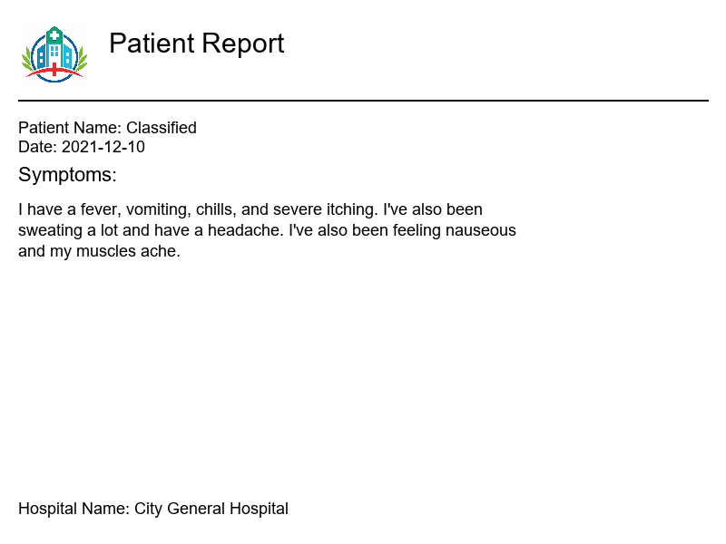
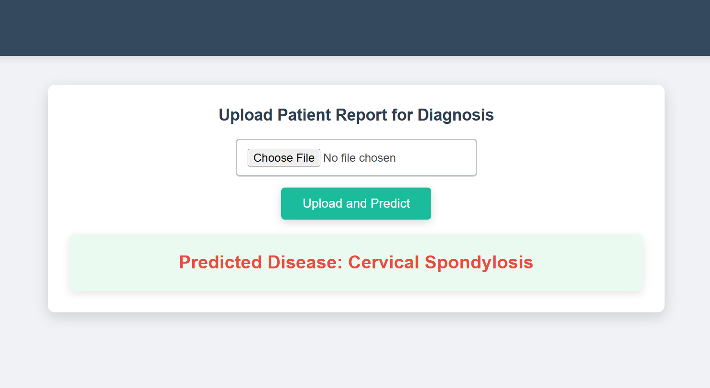

# 🏥 Medical Disease Prediction from the Image of Patient Symptom Reports


## 🚀 Overview
This repository contains a **Medical Disease Prediction System** that analyzes patient symptom reports using **Natural Language Processing (NLP)**. The model leverages both **Support Vector Machines (SVM)** and **fine-tuned BERT** to classify diseases from textual descriptions, improving accuracy and reliability. The project also features a **Flask-based web app** for easy interaction.

---
## 📂 Directory Structure
```
📦 Medical-Disease-Prediction
├── 📁 bert_training        # Fine-tuning BERT for text-based disease prediction
│   ├── 📝 BERT_training_notebook.ipynb
│   ├── 📜 clinical-stopwords.txt
│   ├── 🏗️ model/ (BERT model files)
│   ├── 📄 tokenizer/ (Tokenizer files)
│   ├── 📊 train.csv | test.csv (Datasets)
│
├── 📁 flask              # Flask web application for deployment
│   ├── 📝 app.py (Main server script)
│   ├── 🏗️ model artifacts (SVM model, label encoder, TF-IDF vectorizer)
│   ├── 📜 templates/index.html
│
├── 📁 testing            # Model evaluation on unseen data
│   ├── 📝 testing_notebook.ipynb
│   ├── 🏗️ bert/ (BERT model & tokenizer)
│   ├── 🏗️ svc_model/ (SVM model files)
│
├── 📁 training           # Training traditional ML models
│   ├── 📝 training_notebook.ipynb
│   ├── 📊 train.csv | test.csv | image datasets
│   ├── 🏗️ Pre-trained artifacts (SVM model, encoder, TF-IDF vectorizer)
│
└── 📄 README.md          # This file
```
---
## 📌 Key Features
✅ **Machine Learning (SVM):** Achieves **97% accuracy** on text-based disease classification.
✅ **Deep Learning (BERT):** Fine-tuned **BERT** for enhanced prediction performance.
✅ **Web Deployment:** Flask-based web app for real-time predictions.
✅ **Pre-processing Pipeline:** Includes **stopword removal, TF-IDF vectorization**, and **text tokenization**.
✅ **Modular Codebase:** Well-structured for **training, testing, and deployment**.

---
## 🔬 Model Development Steps
### 1️⃣ Data Preprocessing
- Loaded the dataset containing patient symptom reports.
- Performed **text cleaning**, including stopword removal using `clinical-stopwords.txt`.
- Converted text data into numerical form using **TF-IDF vectorization**.
- Split the dataset into **training (80%)** and **testing (20%)** sets.

### 2️⃣ Traditional Machine Learning Model Training
Experimented with the following ML models:
- **Logistic Regression**
- **Decision Tree Classifier**
- **Random Forest Classifier**
- **K-Nearest Neighbors (KNN)**
- **Support Vector Machine (SVM)**
- **XGBoost**

**SVM was selected as the best-performing model** due to its highest accuracy of **97%**.

### 3️⃣ Deep Learning with BERT
- Fine-tuned a **BERT-based model** for improved disease classification.
- Tokenized text input using **Hugging Face's tokenizer**.
- Trained the model on **GPU** to enhance learning efficiency.

### 4️⃣ Model Testing
- Evaluated the SVM and BERT models using **testing_notebook.ipynb**.
- Compared their accuracy scores, confirming SVM’s strong performance.

### 5️⃣ Deploying the Web App
```bash
cd flask
python app.py
```
Visit **[http://127.0.0.1:5000](http://127.0.0.1:5000)** to access the web interface.

---
## 📊 Results
| Model       | Accuracy |
|------------|----------|
| **SVM**    | 97%      |
| **BERT**   | 92.9%    |

---
## 📸 Screenshots
### 🔹 Image Dataset Overview (Patient Symptoms Report)


### 🔹 Web Interface



---
## 🏆 Acknowledgments
- Datasets sourced from **Kaggle** and real-world clinical datasets.
- Inspired by **medical diagnosis AI research** and NLP-based disease classification.

---
## 📜 License
This project is licensed under the **MIT License**.

💡 **Contributions are welcome!** Feel free to fork and submit a PR. 🚀

